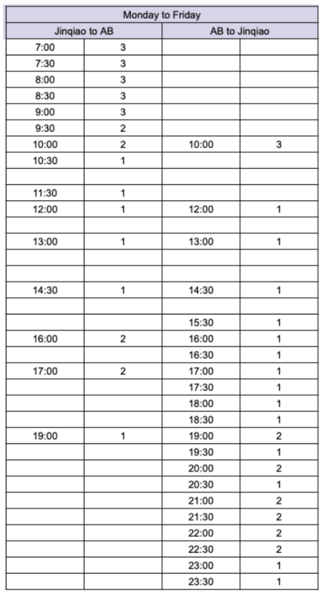

# Optimization-Final-Project

Please check the final outcome in `Project Report.pdf`. We implemented GAMS to solve the schedule optimization problem formulated in Spatio-temporal networks.

Optimized Schedule: 

